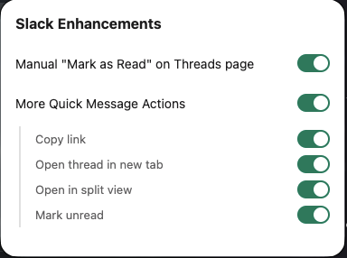
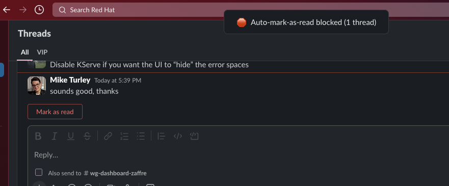
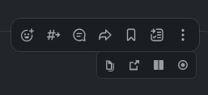

# Slack Enhancements

A browser extension that adds quality-of-life improvements to the Slack web interface. Built with [WXT](https://wxt.dev/) for Firefox (MV3).

## Features

All features can be individually toggled from the extension popup.

to

### Manual Thread Read Control

Prevents the Threads page from automatically marking threads as read as you scroll past them. Instead:

- Automatic `subscriptions.thread.mark` API calls are intercepted at the XHR level and suppressed with fake success responses, so Slack doesn't retry.
- A **"Mark as read"** button appears on each thread with unread messages, letting you explicitly dismiss them.
- Threads viewed on other pages (channels, DMs) are still marked as read normally.



### Quick Message Actions

Adds a secondary toolbar on message hover with shortcuts that are normally buried in menus:

- **Copy link** — One-click permalink copy to clipboard.
- **Open thread in new tab** — Opens the message's thread in a new tab with the thread panel automatically expanded.
- **Open in split view** — Opens the thread's split view (the native Slack feature that's normally several clicks deep).
- **Mark unread** — Marks the message as unread without right-clicking or opening a menu.

Each action can be individually enabled or disabled in the popup settings.



#### How it works

A content script running in the page's [MAIN world](https://developer.mozilla.org/en-US/docs/Mozilla/Add-ons/WebExtensions/Content_scripts#main_world) wraps `XMLHttpRequest.prototype` before Slack's scripts load. When you're on the Threads page, mark-as-read requests are redirected to a blob URL returning `{"ok":true}`, preventing Slack from knowing the request was blocked. The intercepted request parameters (token, timestamps, URL) are captured and stored per-thread so they can be replayed exactly when you click "Mark as read".

## Pairing with a Redirect Blocker

Slack's web client often tries to redirect you to the desktop app when you open a Slack link. This extension pairs well with a separate extension that blocks that redirect behavior:

- **Firefox**: [Slack Redirect](https://addons.mozilla.org/en-US/firefox/addon/slack-redirect/)
- **Chrome**: [Open Slack in browser, not app](https://chromewebstore.google.com/detail/open-slack-in-browser-not/jkgehijlkoolgcjifalbiicaomkngakb)

## Getting Started

### Prerequisites

- Node.js 18+ and npm
- Firefox

### Development

```bash
npm install

# Dev mode with hot reload
npm run dev:firefox
```

Then load the extension: go to `about:debugging#/runtime/this-firefox`, click "Load Temporary Add-on", and select the `manifest.json` in `.output/firefox-mv3`.

### Build

```bash
npm run build:firefox
```

### Test & Lint

```bash
npm test
npm run lint
```
