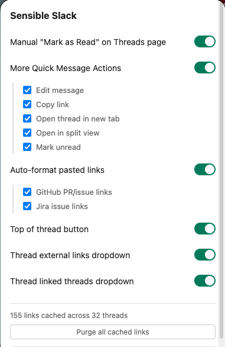
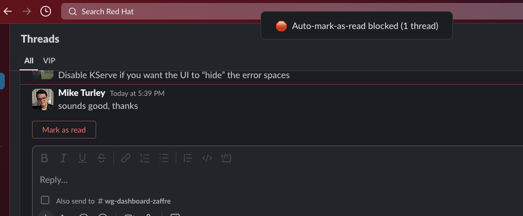
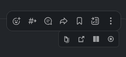

# Sensible Slack

A browser extension that adds quality-of-life improvements to the Slack web interface, including manual thread read control, quick message actions, and thread link dropdowns that surface external links and linked threads from long conversations. Built with [WXT](https://wxt.dev/) for Chrome and Firefox (MV3).

## Features

All features can be individually toggled from the extension popup.



### Manual Thread Read Control

Prevents the Threads page from automatically marking threads as read as you scroll past them. Instead:

- Automatic `subscriptions.thread.mark` API calls are intercepted at the XHR level and suppressed with fake success responses, so Slack doesn't retry.
- A **"Mark as read"** button appears on each thread with unread messages, letting you explicitly dismiss them.
- Threads viewed on other pages (channels, DMs) are still marked as read normally.



### Quick Message Actions

Adds a secondary toolbar on message hover with shortcuts that are normally buried in menus:

- **Copy link** — One-click permalink copy to clipboard.
- **Open thread in new tab** — Opens the message's thread in a new tab with the thread panel automatically expanded.
- **Open in split view** — Opens the thread's split view (the native Slack feature that's normally several clicks deep).
- **Mark unread** — Marks the message as unread without right-clicking or opening a menu.

Each action can be individually enabled or disabled in the popup settings.



### Thread External Links Dropdown

Surfaces all external links shared in a thread via a button in the thread header. Works in both the thread sidebar panel and the Threads page.

- A **"N external links"** button appears in the thread header showing how many unique external URLs have been shared.
- Clicking the button opens a dropdown with links grouped by domain, with Jira and GitHub links prioritized at the top.
- Rich metadata (page title, description, favicon) is captured from Slack's link previews when available. Links without previews show smart display names (e.g. `repo#123` for GitHub PRs, `PROJ-123` for Jira issues).
- Links are cached in extension storage so they persist across page reloads and are available immediately when you reopen a thread.
- On the Threads page, when you scroll past a thread's header, the button floats in the top-right corner so it stays accessible while you read.
- New links are detected as you scroll through long threads with lazy-loaded messages.

### Thread Linked Threads Dropdown

Surfaces links to other Slack threads that appear in the current thread.

- A **"N linked threads"** button appears alongside the external links button.
- Clicking opens a dropdown showing each linked thread with its channel name, author, and a message preview (when available from Slack's unfurl).
- Threads are deduplicated and sorted most-recent-first.

### Link Cache Management

Both thread link features share a persistent cache managed from the extension popup:

- The popup shows how many links are cached across how many threads.
- A **purge** control lets you clear cached links older than 1 day, 7 days, 30 days, or all time.

#### How it works

A content script running in the page's [MAIN world](https://developer.mozilla.org/en-US/docs/Mozilla/Add-ons/WebExtensions/Content_scripts#main_world) wraps `XMLHttpRequest.prototype` before Slack's scripts load. When you're on the Threads page, mark-as-read requests are redirected to a blob URL returning `{"ok":true}`, preventing Slack from knowing the request was blocked. The intercepted request parameters (token, timestamps, URL) are captured and stored per-thread so they can be replayed exactly when you click "Mark as read".

## Pairing with a Redirect Blocker

Slack's web client often tries to redirect you to the desktop app when you open a Slack link. This extension pairs well with a separate extension that blocks that redirect behavior:

- **Firefox**: [Slack Redirect](https://addons.mozilla.org/en-US/firefox/addon/slack-redirect/)
- **Chrome**: [Open Slack in browser, not app](https://chromewebstore.google.com/detail/open-slack-in-browser-not/jkgehijlkoolgcjifalbiicaomkngakb)

## Getting Started

### Prerequisites

- Node.js 18+ and npm
- Chrome and/or Firefox

### Development

```bash
npm install

# Dev mode with hot reload (Chrome)
npm run dev

# Dev mode with hot reload (Firefox)
npm run dev:firefox
```

Then load the extension in your browser:

- **Chrome**: go to `chrome://extensions`, enable "Developer mode", click "Load unpacked", and select the `.output/chrome-mv3` directory.
- **Firefox**: go to `about:debugging#/runtime/this-firefox`, click "Load Temporary Add-on", and select the `manifest.json` in `.output/firefox-mv3`.

### Build

```bash
# Both browsers
npm run build

# Chrome only
npm run build:chrome

# Firefox only
npm run build:firefox
```

### Test & Lint

```bash
npm test
npm run lint
```

## Disclaimer

This extension was vibe-coded with [Claude Code](https://claude.ai/code). Use at your own risk.

## License

[CC0 1.0](LICENSE) — Public domain.